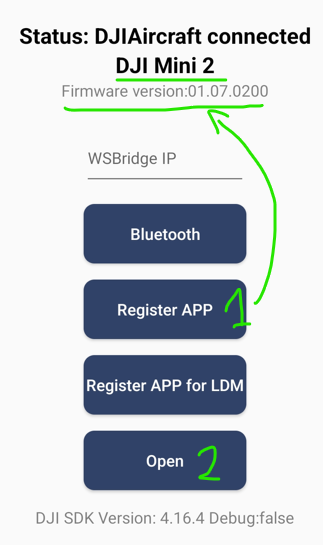
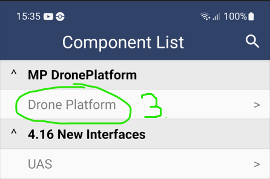
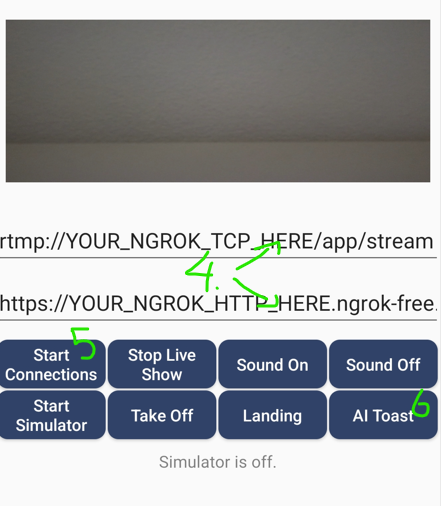

<h1 align="center">Drone AI vision control app</h1>
<h2 align="center">based on DJI Mobile SDK V4 sample app</h2>

## :book: Introduction
Before you start reading this README, I strongly recommend reading the one from the [original repo](https://github.com/dji-sdk/Mobile-SDK-Android/).
This app is dedicated to work with Drone AI vision system from [this repo][drone_platform].

## :hammer: Tech setup
This demo is prepared to use with **DJI** drones which supports MobileSDK **4.16.4** (V5 drones are not supported - like Mini 3 series). In my case it is DJI Mini 2.
The original application has been extended with a new view called "DronePlarformView.java".
 This application has three main tasks: 
- send RTMP stream (and live preview on the phone)
- receive SignalR messages 
- and execute commands to drone
**For more details look on "Diagram_Drone_Complex.png"**

## :iphone: Usage
Refere to original repo to lern how to get started with DJI Mobile SKD applications.
Follow this steps:
**1.** After you put you App Key in AndroidManifest.xml, you can run the app and press the "Resigter" button. After that you should see the name of Your Drone and its firmware version which is proof that the app is connected to the drone.

**2.** Press the "Open" button. After that you should see the list of all views in the app.

**3.** Drone Platform view will be the first one. Please press it.

**4.** Please ensure that Nginx RTMP & ControlBroker service is started as described in [this repo][drone_platform]. Put your ngrok addresses of the Nginx RTMP & ControlBroker services in the appropriate fields.

**5.** Press "Start Connection" button. If everything is ok, you should see the Toas with "Connected" message.

**6.** Press "AI Toast"/"AI Flight" button to switch the operation mode. For the beginning I recommend to use "AI Toast" mode.
>[!IMPORTANT]  
>I strongly recommend to flight in the open area. The drone can be easily damaged or it could hurt someone. I am not responsible for any damage or injury caused by the use of this application.

[drone_platform]: https://github.com/pazdzioch87/Drone-AI-Vision-Control
